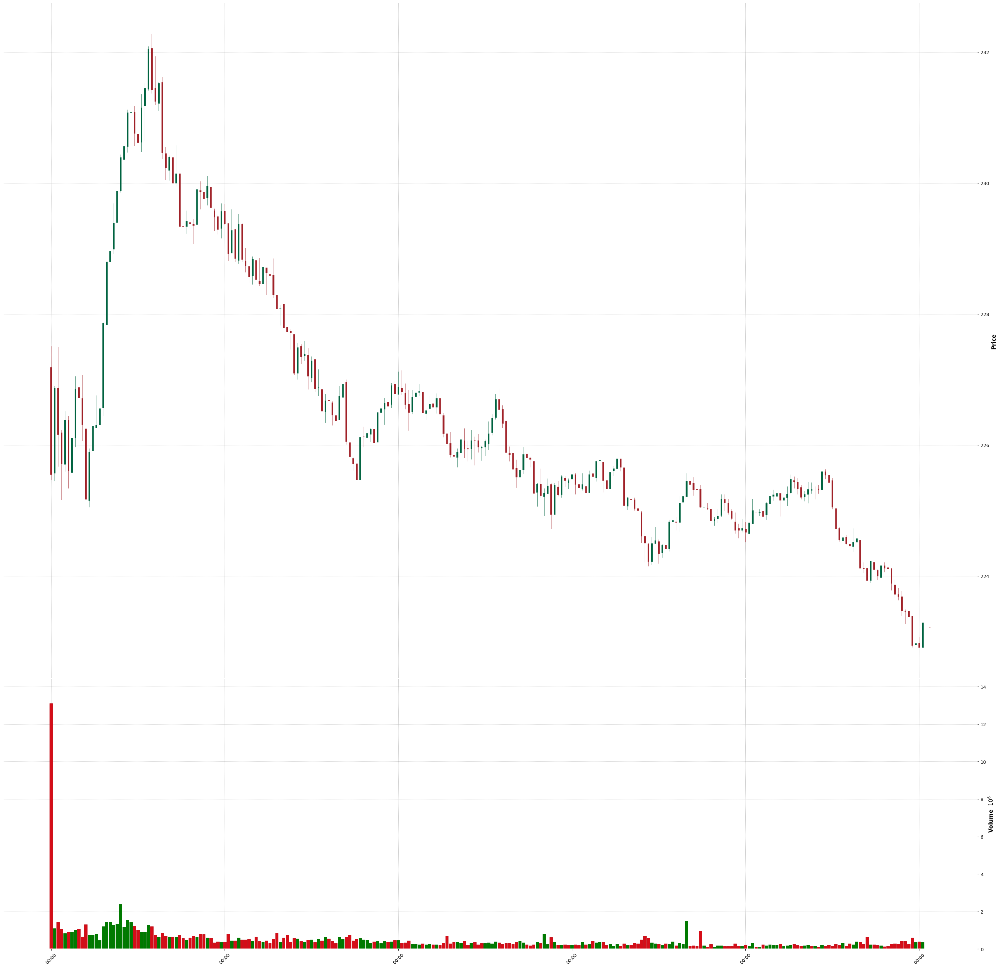

# Day Trade LangChain Agent

An AI agent built on the LangChain framework for retrieving, analyzing, visualizing, and acting on financial candlestick data. It integrates Yahoo Finance data retrieval, deep learning (YOLO) pattern detection, and Telegram notifications to support day trading research and automation.

## Features

- **Candlestick Data Retrieval**: Fetches minute-level OHLCV data for stocks from Yahoo Finance.
- **Candlestick Chart Generation**: Converts CSV OHLCV data into high-resolution candlestick charts.
- **Pattern Detection**: Uses a YOLO model to detect trading patterns from candlestick chart images.
- **Signal Notification**: Sends trading signals to Telegram chats.
- **CSV Utilities**: Save and manage candlestick data in CSV format.

## Model

- Model: YOLOv8s
- Huggingface repo: https://huggingface.co/foduucom/stockmarket-future-prediction
- Description: The YOLOv8s Stock Market future trends prediction model is an object detection model based on the YOLO (You Only Look Once) framework. It is designed to detect various chart patterns in real-time stock market trading video data.
- Download: Run `hf_hub_download.py` to download the model to local environment

## Directory Structure

```
src/
  agent/                # Trading agent logic
  configs/              # Configuration files (API keys, tokens)
  dataset/              # Data storage (CSV, images)
  signals/              # Signal processing
  tests/                # Unit tests
  tools/                # Core tools (see below)
    candle_retriever.py         # Yahoo Finance OHLCV fetcher
    format_candle_chart.py      # Candlestick chart generator
    detect_pattern_from_chart.py# YOLO-based pattern detection
    handle_trading_signal.py    # Telegram notification
    save_candles_to_csv.py      # CSV utilities
  utils/                # Utils helper tools
```

## Setup

1. Clone the repo and set up a Python 3.9+ environment.
2. Install requirements:
   ```bash
   pip install -r requirements.txt
   ```
3. Configure your API keys in `src/configs/`


## Sample Candlestick Chart

Below is a sample generated candlestick chart:

<p align="center">
  
</p>

## Usage

- **Retrieve Candles:**
  ```python
  from src.tools.candle_retriever import candle_retriever
  data = candle_retriever('AAPL')
  ```
- **Save Candles to CSV:**
  ```python
  from src.tools.save_candles_to_csv import save_candles_to_csv
  save_candles_to_csv(data['candles'])
  ```
- **Generate Chart:**
  ```python
  from src.tools.format_candle_chart import format_candle_chart_from_csv
  format_candle_chart_from_csv('src/dataset/candle_data.csv')
  ```
- **Pattern Detection:**
  ```python
  from src.tools.detect_pattern_from_chart import detect_pattern_from_chart
  detect_pattern_from_chart('src/dataset/candle_chart.png')
  ```
- **Send Signal to Telegram:**
  ```python
  from src.tools.handle_trading_signal import notify_signal_sync
  notify_signal_sync('UP', 0.95, 'AAPL')
  ```

## Sample Signal Output

Example Telegram message (HTML) sent by the agent:

```
<b>Asset :</b> AAPL
<b>Signal:</b> UP (BULLISH)
<b>Confidence score  :</b> 95.00%
<b>Time  :</b> 2026-05-31 15:45:00
```

When the signal is unrecognized, the agent will skip sending a notification and log a warning.

## Notes
- Yahoo Finance API is rate-limited and may block frequent requests.
- YOLO model weights must be placed in `models/yolo/best.pt`.
- Telegram bot token and chat ID must be set in `src/configs`.

## License
MIT
